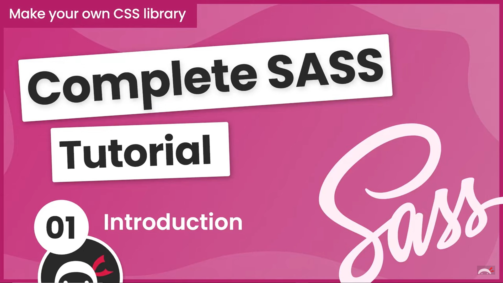

# Complete SASS Tutorial - The Net Ninja

### ▶️ [Complete tutorial playlist](https://www.youtube.com/playlist?list=PL4cUxeGkcC9jxJX7vojNVK-o8ubDZEcNb)
### 👀 Project demo: 👉 [Click here](https://kellychi22.github.io/complete-sass-tutorial/public/)
### ✏️ Note
In the tutorial, he is using `@import` syntax for importing Sass and CSS stylesheets. However, according the the Sass team, 

> The Sass team discourages the continued use of the @import rule. Sass will gradually phase it out over the next few years, and eventually remove it from the language entirely. Prefer the @use rule instead.

which means using `@use` and `@forward` is a better practice now.

In my scss stylesheets, I changed all the `@import` syntax to `@use`. This requires a bit of modification regarding the variable scope problem. For more explanation, please refer to this nice article: [@use & @forward in SASS](https://dev.to/mr_ali3n/use-forward-in-sass-2bab).

In short, this is a very nice tutorial for learning Sass, and more than that, you can learn how CSS libraries or frameworks like Bootstrap or Tailwind work under the hood! Highly recommended.

